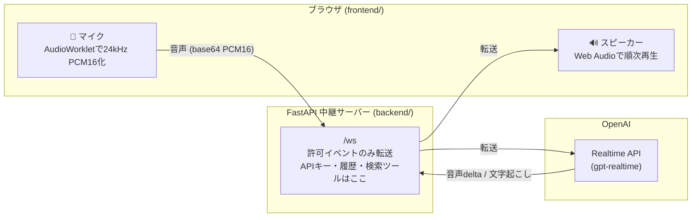

# Push-to-Talk リアルタイム音声通話

ブラウザ(Push-to-Talk) ↔ FastAPI(WebSocket中継) ↔ OpenAI Realtime API の構成。
APIキーはサーバー側の `.env` にのみ保持し、ブラウザには一切渡らない。

## 構成



- 押している間: `input_audio_buffer.append`(base64 PCM16 24kHz)を送信
- 離した時: `input_audio_buffer.commit` + `response.create`
- 応答中に押すと `response.cancel` + 再生停止で割り込み(バージイン)
- サーバーVAD(`turn_detection`)は無効化し、PTTで発話区間を制御
- 会話の文字起こしは SQLite(`chat_history.db`)に自動保存され「履歴」タブで見返せる
- モデルが最新情報を必要と判断すると `web_search` ツールを呼び出し、
  サーバーが OpenAI Responses API の Web 検索で調べて結果を返す(ハルシネーション対策)
- ペルソナ(キャラ設定+声)をリストボックスで切り替え可能。定義は `personas/*.md` に
  frontmatter(`name`, `voice`)+本文(instructions)で記述し、ファイルを追加するだけで
  選択肢に反映される。切り替え時は新しいセッションとして接続し直す
- 入力マイクもリストボックスで切り替え可能(選択は保存され、抜き差しにも追従。
  選択中のマイクが使えない場合は既定のマイクへ自動フォールバック)

**仕組みの図解は [docs/architecture.md](docs/architecture.md) にある**(コードを読まずに全体を理解できる。実装を変えるPRでは図も更新すること)。

## ディレクトリ構成

```
backend/    FastAPIサーバー(main.py)、personas/、pyproject.toml、.env
frontend/   ブラウザ側一式(index.html, app.js, pcm-worklet.js, login.html)
infra/      Terraform(Cognito認証基盤)
```

## セットアップ

[uv](https://docs.astral.sh/uv/) を使用(依存関係は pyproject.toml / uv.lock で管理)。

```bash
cd realtime_voice/backend
cp .env.example .env   # OPENAI_API_KEY を設定
uv sync                # .venv 作成 + 依存インストール
```

## 起動

```bash
cd backend
uv run uvicorn main:app --port 8000
```

ブラウザで http://localhost:8000 を開き、ボタン(またはスペースキー)を
押している間だけ話す。マイク許可が必要。

## 認証(任意)

`.env` に `COGNITO_*` を設定すると Amazon Cognito 認証が有効になる
(未設定なら認証なしで動作)。ログインは Hosted UI への
リダイレクト(認可コード + PKCE)で、IDトークンは Cookie に保持する。
`GET /` はサーバー側で Cookie のトークンを検証し、未認証には
アプリ本体のHTMLを返さず門番ページ(login.html)だけを返す
(未認証者にUIを一瞬も見せない)。バックエンドは HTTP API と
WebSocket の両方でも IDトークンを検証する。WebSocket は接続後の
最初のメッセージ `proxy.auth {token}` で認証し、トークンをURLに
載せない(アクセスログ対策)。ユーザー作成は管理者のみ
(セルフサインアップ無効):

```bash
aws cognito-idp admin-create-user --user-pool-id <POOL_ID> \
  --username <メールアドレス> --message-action SUPPRESS
aws cognito-idp admin-set-user-password --user-pool-id <POOL_ID> \
  --username <メールアドレス> --password '<パスワード>' --permanent
```

## インフラ (Terraform)

Cognito 一式(User Pool / アプリクライアント / Hosted UIドメイン)は
`infra/` の Terraform で管理している。

```bash
cd infra
terraform init
terraform plan    # 差分確認
terraform apply
terraform output cognito_env   # .env に貼る値が出力される
```

新しい環境に作る場合は `variables.tf` の `domain_prefix`(グローバルで
一意)を変えて apply し、`imports.tf` は削除する。state はローカル管理
(gitignore済み)。

※ getUserMedia の制約上、localhost 以外で使う場合は HTTPS が必要。
