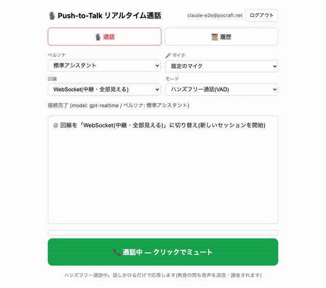
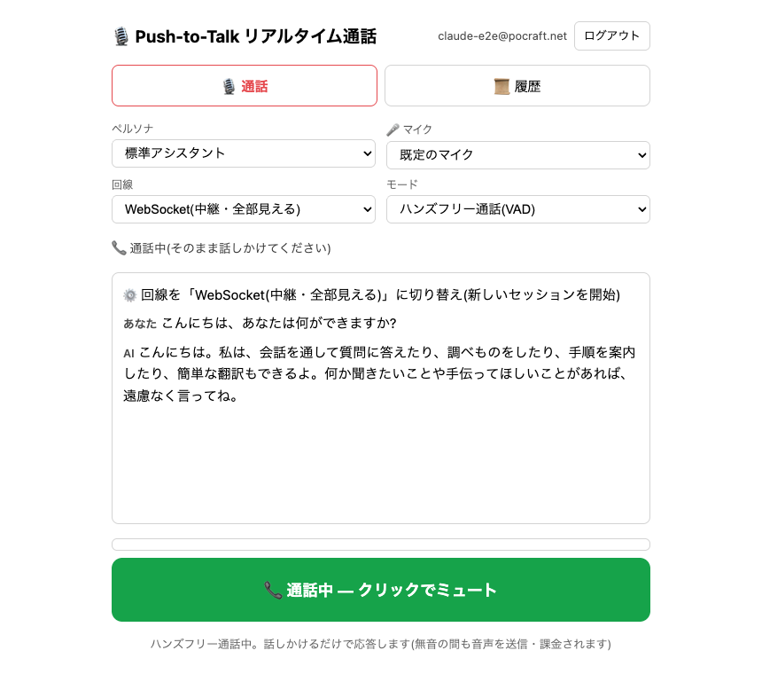
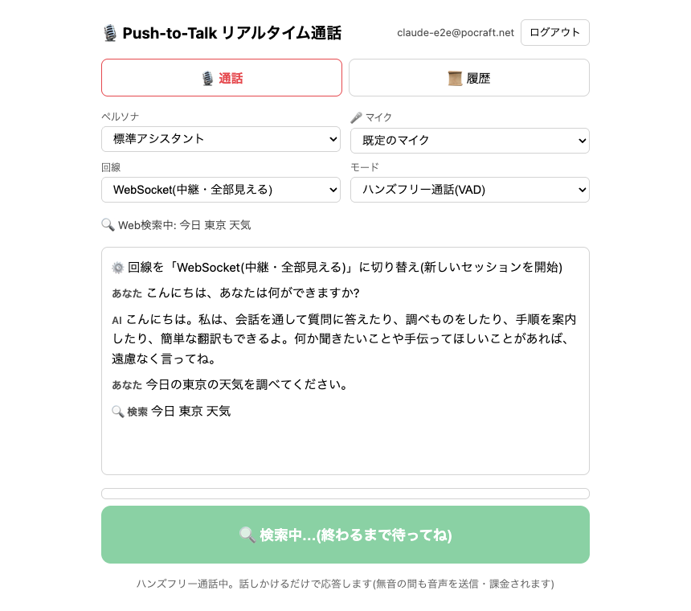
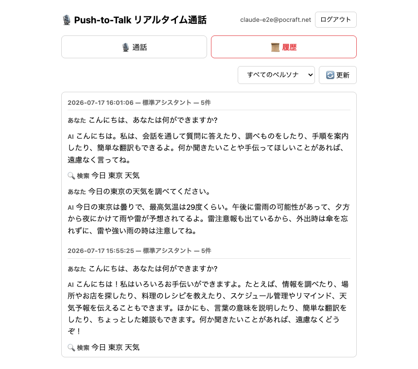
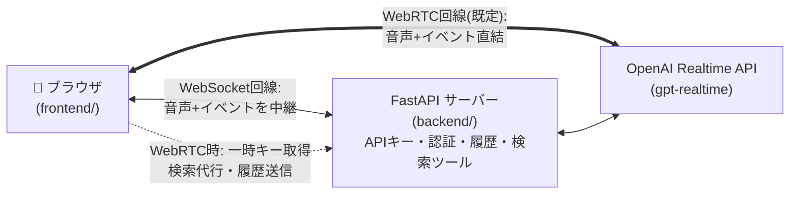

# リアルタイム音声通話 (Push-to-Talk / ハンズフリー)

ブラウザ ⇄ OpenAI Realtime API のリアルタイム音声通話アプリ。
**回線**は WebRTC(直結・既定) と WebSocket(FastAPI中継) の2方式、
**会話モード**は Push-to-Talk と ハンズフリー通話(VAD) の2方式を、UIで自由に組み合わせられる。
APIキーはサーバー側の `.env` にのみ保持し、ブラウザには一切渡らない
(WebRTC回線でも、ブラウザに渡るのは数分で失効する一時キーのみ)。

## デモ



人工音声がアプリに話しかけ、AIが音声で応答し、「今日の東京の天気」で
Web検索ツールが発動して回答するまでの**実録**(演出なしのE2E)。
🔊 音声付き: [docs/media/demo.mp4](docs/media/demo.mp4)

| ハンズフリー通話 | Web検索の発動 | 会話履歴 |
|---|---|---|
|  |  |  |

このデモは [tools/record_demo.js](tools/record_demo.js) で自動収録している
(偽マイク+ページ内録音でOS権限不要。手順はスクリプト冒頭のコメント参照)。

## 構成



- **PTTモード**: 押している間 `input_audio_buffer.append`、離すと `commit` + `response.create`。
  応答中に押すと `response.cancel` + 再生停止で割り込み(バージイン)。サーバーVADは無効化し、発話区間はボタンで制御
- **ハンズフリー通話(VAD)モード**: サーバー側の `semantic_vad` が発話の始終を自動検知して応答・バージインまで行う。
  OpenAI側ノイズリダクション(`noise_reduction: near_field`)で物音の誤検知を抑制
- 録音は入力デバイスのネイティブレートで取り、AudioWorkletの面積平均リサンプラで24kHz PCM16化
  (24kHz強制のAudioContextは仮想マイクで音声が壊れるため使わない)
- 会話の文字起こしは SQLite(`chat_history.db`)に自動保存され「履歴」タブで見返せる
- モデルが最新情報を必要と判断すると `web_search` ツールを呼び出し、
  サーバーが OpenAI Responses API の Web 検索で調べて結果を返す(ハルシネーション対策)
- ペルソナ(キャラ設定+声)をリストボックスで切り替え可能。定義は `personas/*.md` に
  frontmatter(`name`, `voice`)+本文(instructions)で記述し、ファイルを追加するだけで
  選択肢に反映される。切り替え時は新しいセッションとして接続し直す
- 入力マイクもリストボックスで切り替え可能(選択は保存され、抜き差しにも追従。
  選択中のマイクが使えない場合は既定のマイクへ自動フォールバック)
- **回線を WebSocket(中継) / WebRTC(直結) で切り替え可能**。WebRTCでは音声と
  イベントがブラウザ⇄OpenAI直結になり、サーバーは一時キー発行・検索代行・
  履歴受信のみを担う(APIキーは渡さない)。比較は docs/architecture.md §7
- **会話モードを PTT / ハンズフリー通話(VAD) で切り替え可能**。VADモードは
  サーバーVADが発話を自動検知して応答する本物のリアルタイム通話で、ボタンは
  ミュートトグルになる(注: 無音の間も音声送信・課金される)。§8参照

**仕組みの図解は [docs/architecture.md](docs/architecture.md) にある**(コードを読まずに全体を理解できる。実装を変えるPRでは図も更新すること)。

## ディレクトリ構成

```
backend/    FastAPIサーバー(main=組み立て, relay=WS中継, webrtc=一時キー発行,
            auth=認証, personas, history, search, config に分割)、personas/、.env
frontend/   ブラウザ側一式(index.html, app.js, webrtc.js, pcm-worklet.js, login.html)
infra/      Terraform(Cognito認証基盤)
Dockerfile / compose.yaml   ローカルコンテナ起動(下記「起動」参照)
```

## セットアップ

[uv](https://docs.astral.sh/uv/) を使用(依存関係は pyproject.toml / uv.lock で管理)。

```bash
cd realtime_voice/backend
cp .env.example .env   # OPENAI_API_KEY を設定
uv sync                # .venv 作成 + 依存インストール
```

## 起動

### ネイティブ(uv)

```bash
cd backend
uv run uvicorn main:app --port 8000
```

### コンテナ(Docker)

```bash
docker compose up --build
```

どちらも同じポート8000・同じ使い勝手。コンテナ版は `backend/.env` を
env_file として注入し(イメージには焼き込まない)、会話履歴は名前付き
ボリューム `chat-history`(コンテナ内 `/data`)に永続化されるため、
コンテナを作り直しても残る。DBの置き場は環境変数 `DB_PATH` で変更可能。

composeを使わず手で立てる場合もポートは8000に揃える(ログとURLが一致して迷わない):

```bash
docker build -t realtime-voice .
docker run --rm -p 8000:8000 --env-file backend/.env realtime-voice
# → http://localhost:8000
```

8000が使用中のとき(開発中の約束事: 検証は8001)は `-p 8001:8000` にして
`http://localhost:8001` を開く(**`-p` の左側がホスト側ポート**)。

**注意**: uvicornの起動ログに出る `http://0.0.0.0:8000` は**コンテナ内部の待ち受け表示**であり、
ブラウザで開くURLではない。開くのは常に `http://localhost:<ホスト側ポート>`。
万一 `0.0.0.0` で開いてもサーバーがlocalhostへリダイレクトする。

ブラウザで http://localhost:8000 を開き、ボタン(またはスペースキー)を
押している間だけ話す。マイク許可が必要。

## 認証(任意)

`.env` に `COGNITO_*` を設定すると Amazon Cognito 認証が有効になる
(未設定なら認証なしで動作)。ログインは Hosted UI への
リダイレクト(認可コード + PKCE)で、IDトークンは Cookie に保持する。
`GET /` はサーバー側で Cookie のトークンを検証し、未認証には
アプリ本体のHTMLを返さず門番ページ(login.html)だけを返す
(未認証者にUIを一瞬も見せない)。バックエンドは HTTP API と
WebSocket の両方でも IDトークンを検証する。WebSocket は接続後の
最初のメッセージ `proxy.auth {token}` で認証し、トークンをURLに
載せない(アクセスログ対策)。ユーザー作成は管理者のみ
(セルフサインアップ無効):

```bash
aws cognito-idp admin-create-user --user-pool-id <POOL_ID> \
  --username <メールアドレス> --message-action SUPPRESS
aws cognito-idp admin-set-user-password --user-pool-id <POOL_ID> \
  --username <メールアドレス> --password '<パスワード>' --permanent
```

## インフラ (Terraform) と本番デプロイ

`infra/` の Terraformは**stateを分けた2スタック**(実行基盤のdestroyがユーザーデータに届かない構造):

- **認証基盤** (`infra/auth`): Cognito一式(User Pool / アプリクライアント / Hosted UIドメイン)。deletion_protection有効
- **サービス基盤** (`infra/service`): ECS Fargate + ALB + ACM + Route53 + EFS + ECR。
  適用すると **https://voice.pocraft.net** でサービスが立つ
  (構成: [docs/aws_architecture.md](docs/aws_architecture.md) /
  手順: [docs/deployment.md](docs/deployment.md) / 図解: docs/architecture.md §10)

```bash
cd infra/auth && terraform init && terraform apply       # 認証基盤
cd ../service && terraform init
echo 'openai_api_key = "sk-..."' > secrets.auto.tfvars   # gitignore済み
terraform apply                                          # 実行基盤一式が立つ
cd ../.. && ./deploy.sh   # イメージbuild → ECR push → サービス起動
```

以後のアプリ更新は `./deploy.sh` 一発。新しい環境に作る場合は
`variables.tf` の `domain_prefix`(グローバルで一意)と `zone_name` /
`service_domain` を変えて apply する。state はローカル管理(gitignore済み)。

※ getUserMedia の制約上、localhost 以外で使う場合は HTTPS が必要
(本番はACM証明書で対応済み。これが service.tf にALB+ACMがある理由)。
