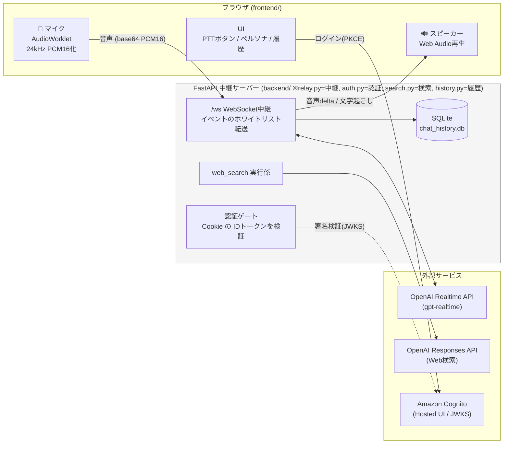
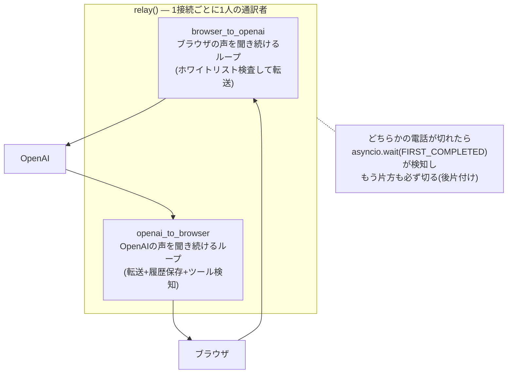
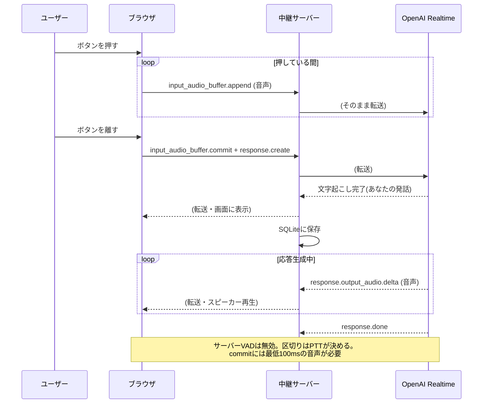
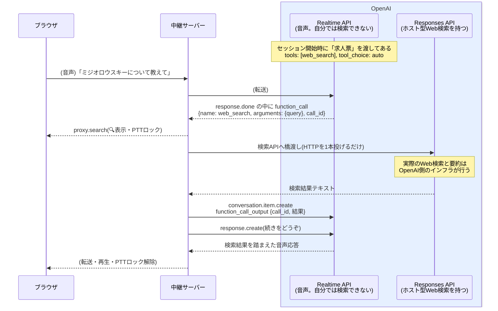
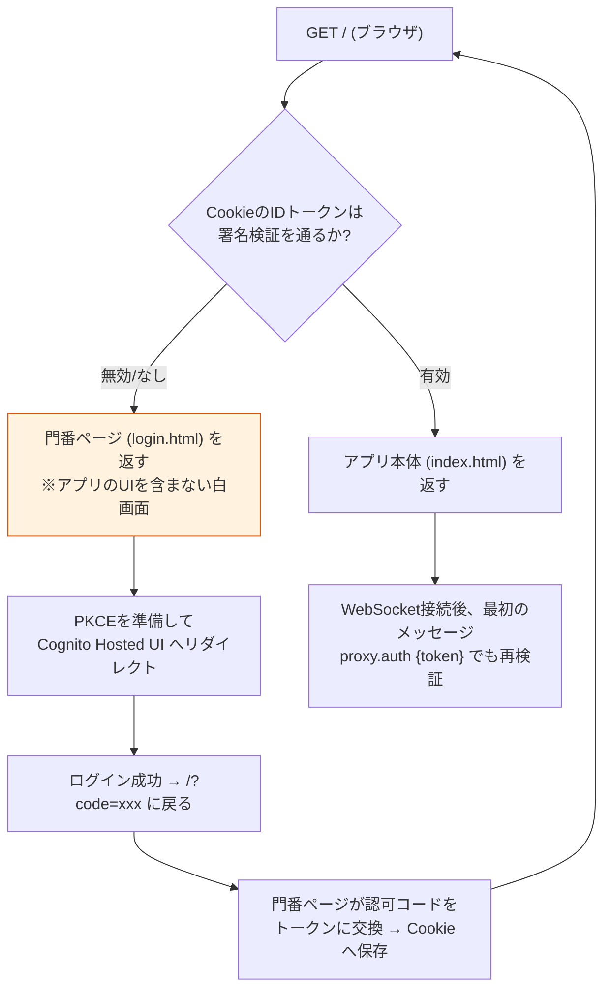
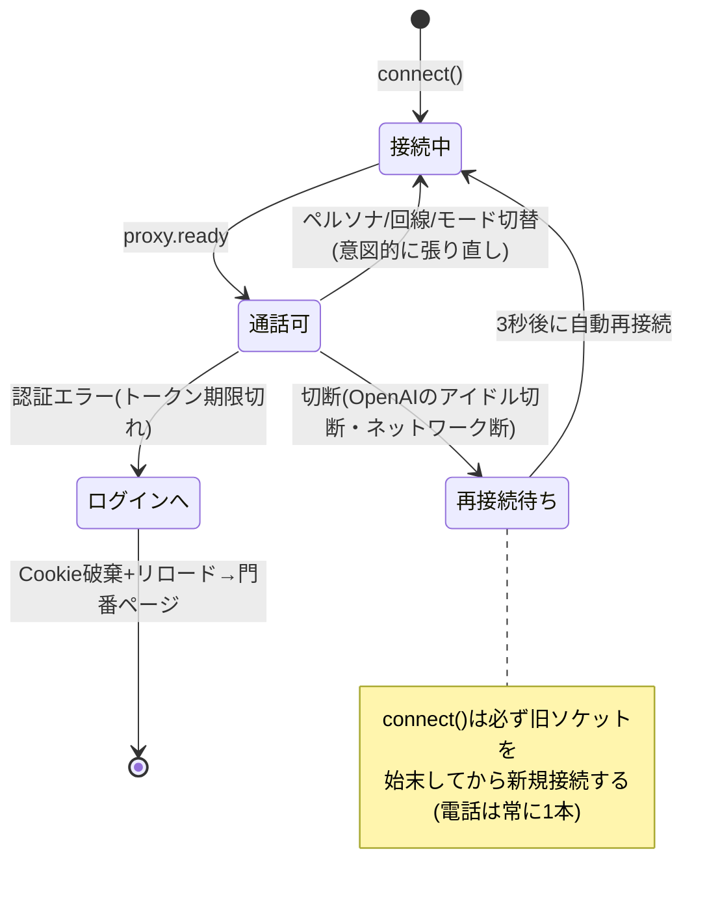
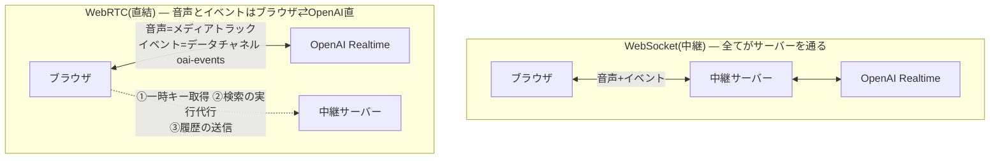
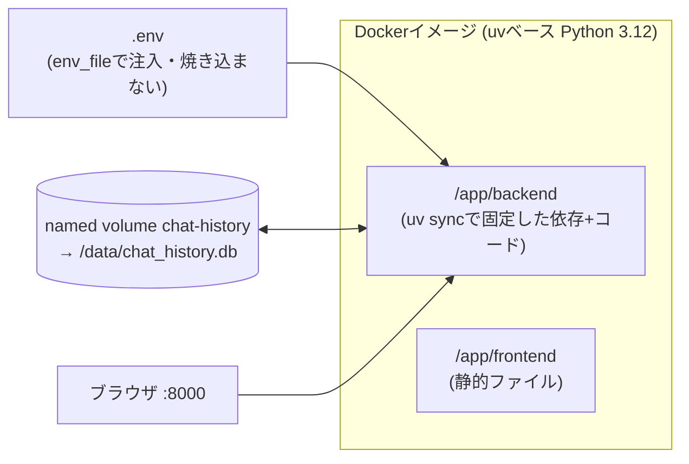

# アーキテクチャ図解

コードを読まなくても仕組みが分かるための図集。実装を変えたら、そのPRでこの図も更新すること。

## 1. 全体像(登場人物と通信路)

APIキーは中継サーバーの `.env` にのみ存在し、ブラウザには一切渡らない。

**注: この図はWebSocket(中継)回線の全体像。既定の回線はWebRTC(直結)で、その場合は音声と
イベントがブラウザ⇄OpenAI直結になり、サーバーの役割は一時キー発行・検索代行・履歴受信に
縮む(§7参照)。§2〜§6はWebSocket回線の仕組み、§7以降が回線・モード・コンテナの話。**

## 2. 中継サーバーの本質: 両耳に受話器を持つ通訳者

WebSocketは「リクエスト→レスポンス」ではなく**電話**。どちらからでも、いつでも喋れる。
中継サーバーは2本の電話を同時に持ち、2つのループを並走させる。

**不変条件: ブラウザ側も電話は常に1本だけ。** 再接続時は旧ソケットのハンドラを外して閉じてから新規接続する(これを破ると別セッションの音声・字幕が混線する)。

## 3. Push-to-Talkの1ターン(シーケンス)

## 4. Function Calling(Web検索)の仕組み

モデルは関数を**実行できない**。「呼びたい」という構造化データを出すだけで、実行するのは中継サーバー。

`call_id` が「どの依頼への答えか」を紐付ける伝票番号。中継サーバーは検索エンジンを持っておらず、「検索できない音声モデル」と「検索できるテキストAPI」の橋渡しをしているだけ。`web_search` の中身(橋渡し先)を差し替えれば、社内DB検索でもメール送信でも同じ仕組みで動く。

## 5. 認証(Cognito + 門番ページ)

未認証者にはアプリのHTMLを1バイトも返さない。`GET /` の時点でサーバーが判定する。

**罠**: `/` は認証状態で返す内容が変わるため `Cache-Control: no-store` が必須。
キャッシュされた門番ページが使い回されると、有効なCookieがあってもCognitoへ飛び続ける無限ループになる(実際に起きた)。安全網としてログイン画面への往復4回で中断するガードも入っている。

## 6. 切断と再接続(切断は正常系)

OpenAIはアイドルセッションを自発的に閉じる。PTT設計では切断は発話の合間にしか起きないため、失うものがない。「切られない努力」より「切られても平気な設計」。

## 7. 回線の二方式: WebSocket(中継) と WebRTC(直結)

UIの「回線」リストボックスで切り替えられる。設計初日に比較した2アーキテクチャの両実装。

| 観点 | WebSocket(中継) | WebRTC(直結) |
|---|---|---|
| 音声の経路 | サーバー経由(生PCM16) | ブラウザ⇄OpenAI直(Opus/RTP、ジッター耐性あり) |
| 遅延・回線の悪条件 | やや不利 | 有利 |
| サーバーから見えるもの | 全て(履歴・監査・介入が自然) | 何も見えない(履歴はブラウザからの自己申告) |
| function calling | サーバーが検知・実行 | ブラウザが検知し `/api/search` へ実行を代行依頼 |
| 履歴保存 | サーバーが自動保存 | ブラウザが `/api/history/log` へ送信 |
| APIキー | サーバーのみ | サーバーのみ(ブラウザには数分で失効する一時キー `ek_` だけ) |
| 企業プロキシ/FW | 強い(wss/443の1本) | SDP/UDP経路に依存(片通話の故障モードがある) |

接続手順(WebRTC): サーバーが `/v1/realtime/client_secrets` でペルソナ設定入りの一時キーを発行
→ ブラウザが SDP offer を `/v1/realtime/calls` へPOST → 応答音声はリモートトラック、
イベントはデータチャネルで送受信。PTTはマイクトラックの enabled 切替+clear/commitで実現。

## 8. 会話モード: PTT と ハンズフリー通話(VAD)

「モード」リストボックスで切り替え。どちらの回線(WS/WebRTC)とも組み合わせ可能。

| | 押して話す(PTT) | ハンズフリー通話(VAD) |
|---|---|---|
| 発話の区切り | ボタン(手動commit) | **サーバーVADが自動検知**(speech_started/stopped) |
| 応答の開始 | クライアントが response.create | OpenAIが自動生成 |
| バージイン | ボタン押下で response.cancel | 話し始めると自動で割り込み |
| ボタンの役割 | 押している間だけ録音 | **ミュートトグル**(クリック/スペース) |
| 音声の送信 | 押している間のみ | **常時**(ミュート・検索中を除く) |
| コスト | 話した分だけ | **無音の間も課金**(通話1時間で数ドル規模) |

VADモードの追加挙動: 検索中は自動ミュート(検索結果と新規発話の混線防止)、
WSモードでは speech_started 受信時にローカル再生を停止(バージイン)。
PTTは無線機、VADは電話——用途で使い分ける。

誤検知対策(2段構え): ブラウザ側は getUserMedia の noiseSuppression / echoCancellation /
autoGainControl、OpenAI側はセッション設定の `noise_reduction: near_field`(VADと文字起こしの
手前で入力を掃除する)。机を叩くなどの衝撃音を発話と誤認するのを抑える。両回線共通
(`build_session_config` で埋め込むため、WS中継でもWebRTC直結でも効く)。

## 9. コンテナ構成(ローカル)

「terraform applyしたらサービスが立つ」への段階1。イメージには**コードだけ**を焼き、秘密(.env)と状態(履歴DB)は外から与える。

- 起動: `docker compose up --build`。ネイティブ起動(`uv run uvicorn`)と同じポート8000・同じ使い勝手
- DBパスは環境変数 `DB_PATH` で外から差し替え可能(コンテナでは /data、ECS移行時はここをEFS等に付け替えるだけ)
- コンテナ内のディレクトリ配置はリポジトリと同じ(backend/ が ../frontend を参照する相対関係を維持)
- 段階2(ECS Fargate + Terraform)の論点はCLAUDE.mdのバックログ参照
