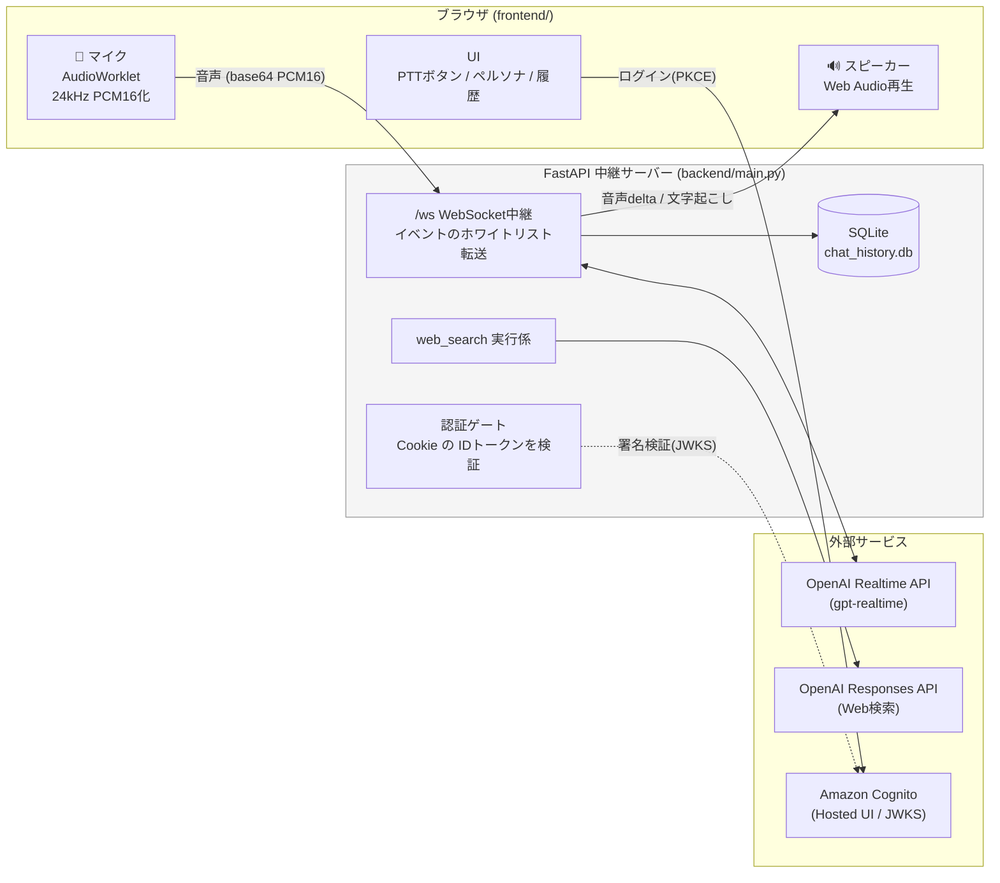
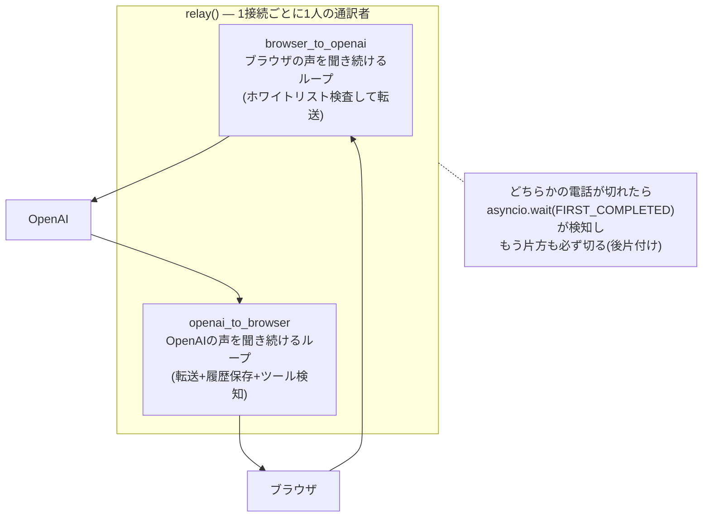
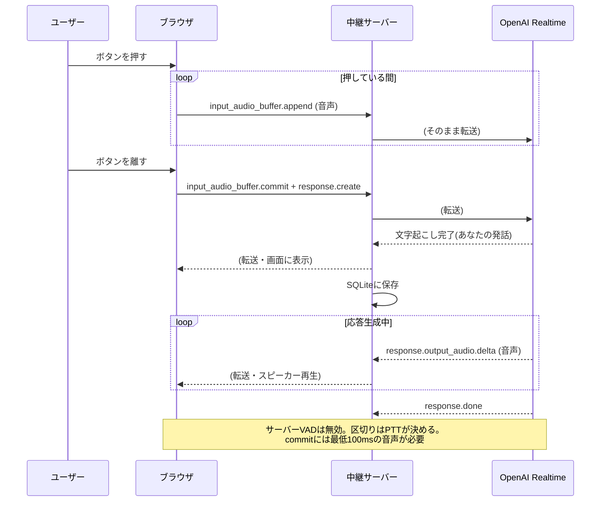
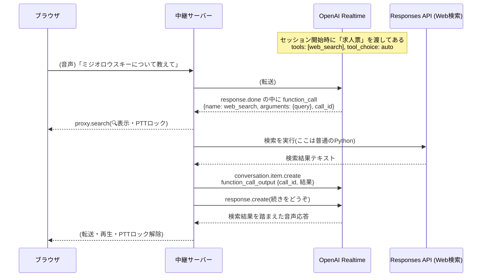
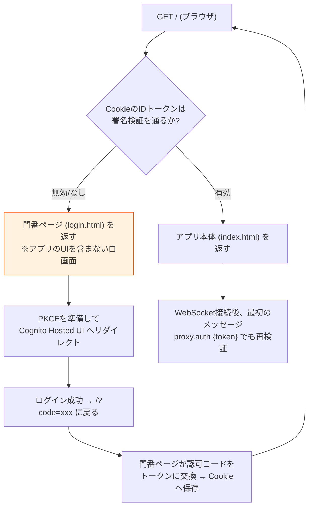
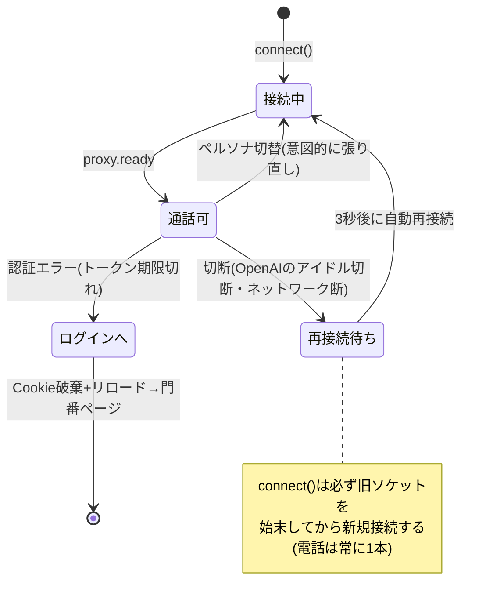

# アーキテクチャ図解

コードを読まなくても仕組みが分かるための図集。実装を変えたら、そのPRでこの図も更新すること。

## 1. 全体像(登場人物と通信路)

APIキーは中継サーバーの `.env` にのみ存在し、ブラウザには一切渡らない。

## 2. 中継サーバーの本質: 両耳に受話器を持つ通訳者

WebSocketは「リクエスト→レスポンス」ではなく**電話**。どちらからでも、いつでも喋れる。
中継サーバーは2本の電話を同時に持ち、2つのループを並走させる。

**不変条件: ブラウザ側も電話は常に1本だけ。** 再接続時は旧ソケットのハンドラを外して閉じてから新規接続する(これを破ると別セッションの音声・字幕が混線する)。

## 3. Push-to-Talkの1ターン(シーケンス)

## 4. Function Calling(Web検索)の仕組み

モデルは関数を**実行できない**。「呼びたい」という構造化データを出すだけで、実行するのは中継サーバー。

`call_id` が「どの依頼への答えか」を紐付ける伝票番号。`web_search` の中身を差し替えれば、社内DB検索でもメール送信でも同じ仕組みで動く。

## 5. 認証(Cognito + 門番ページ)

未認証者にはアプリのHTMLを1バイトも返さない。`GET /` の時点でサーバーが判定する。

**罠**: `/` は認証状態で返す内容が変わるため `Cache-Control: no-store` が必須。
キャッシュされた門番ページが使い回されると、有効なCookieがあってもCognitoへ飛び続ける無限ループになる(実際に起きた)。安全網としてログイン画面への往復4回で中断するガードも入っている。

## 6. 切断と再接続(切断は正常系)

OpenAIはアイドルセッションを自発的に閉じる。PTT設計では切断は発話の合間にしか起きないため、失うものがない。「切られない努力」より「切られても平気な設計」。
