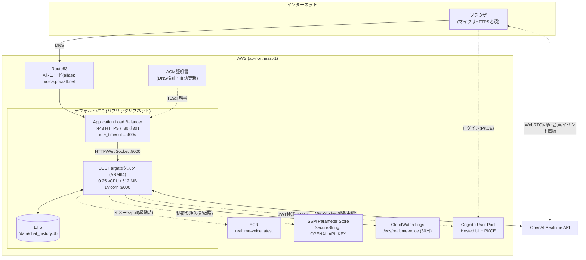
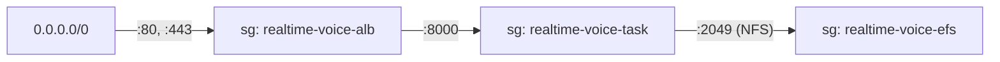
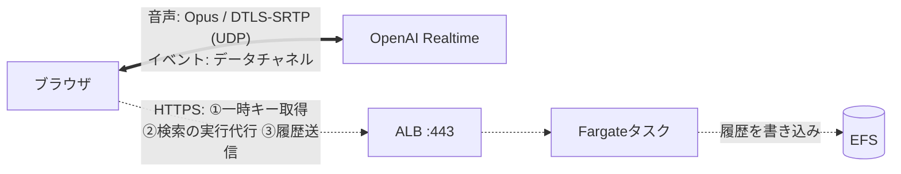
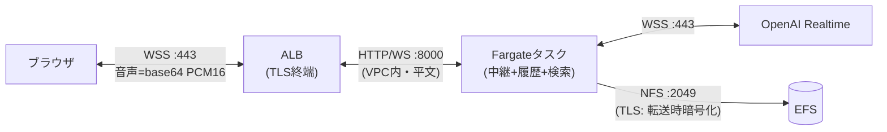

# AWS構成

本番環境の構成。すべて Terraform (`infra/`) で管理しており、`terraform apply` 一発で下記の全体が立ち上がり、ターゲット指定の `terraform destroy` で片付く。再現性は検証済み: サービス層全体を実際に破壊→ゼロから再構築し、手作業なしで復旧することを確認している。

稼働URL: **https://voice.pocraft.net**

## 全体図

## コンポーネントと設計判断

| コンポーネント | 選択 | 理由 |
|---|---|---|
| コンピュート | ECS Fargate、ARM64、0.25vCPU/512MB | サーバー管理ゼロ。ARM64はApple Siliconの`docker build`がそのまま載り(クロスビルド不要)、料金も安い |
| ネットワーク | デフォルトVPC、パブリックサブネット、タスクにパブリックIP | NATゲートウェイ代ゼロ(デモ用途では十分)。タスクへはALBのSG経由でしか届かない |
| TLS/ドメイン | ACM証明書 + Route53 alias | `getUserMedia`(マイク)はセキュア文脈でしか動かない——HTTPSは飾りではなく**必須要件** |
| ロードバランサ | ALB、`idle_timeout = 400s` | uvicornのWebSocket ping間隔(既定20s)より必ず長くする。逆転するとハンズフリー(VAD)モードの長い無音でソケットが切られる |
| 履歴DB | EFS上のSQLite(`/data`にマウント) | アプリはローカル開発と無変更——`DB_PATH`の向き先が変わるだけ。タスクの再起動・再デプロイをまたいで残る |
| 秘密 | SSM SecureString → タスク起動時にECSが注入 | [deployment.md](deployment.md#シークレット) 参照 |
| 認証 | 既存のCognito User Pool(Terraformの別レイヤー) | サービス層のteardownがユーザーアカウントに触れない分離。アプリクライアントのコールバックURLに `https://voice.pocraft.net/` を追加済み |
| ログ | CloudWatch Logs、保持30日 | Fargateにおける`docker logs`相当 |

## セキュリティグループ(一方向の連鎖)

各ホップは1つ前のセキュリティグループからの通信しか受けない。タスクとファイルシステムにはインターネットから直接届かない。

## データの通信経路

### 音声の経路は回線で全く違う

**WebRTC回線(既定) — 音声はAWSを通らない。** ALBを通るのは制御系のHTTPSだけ。

**WebSocket回線 — すべてがAWSを通る。** `idle_timeout` のルールが守っているのはこちら。

### 経路とプロトコルの一覧

| データ | 経路 | プロトコル / ポート | 暗号化 |
|---|---|---|---|
| 音声(WebRTC回線) | ブラウザ ⇄ OpenAI 直結 | Opus over SRTP (UDP)、SDP交換はHTTPS | DTLS-SRTP |
| イベント(WebRTC回線) | ブラウザ ⇄ OpenAI 直結 | WebRTCデータチャネル `oai-events` | DTLS |
| 音声・イベント(WS回線) | ブラウザ → ALB → タスク → OpenAI | WSS:443 → HTTP/WS:8000 → WSS:443 | ALBでTLS終端。**ALB→タスク間はVPC内の平文**(SGでALBからのみ許可) |
| ログイン | ブラウザ ⇄ Cognito Hosted UI | HTTPS(認可コード+PKCE) | TLS。トークンはCookie(ブラウザ)のみ |
| JWT検証 | タスク → Cognito | HTTPS(JWKS取得、キャッシュあり) | TLS |
| Web検索(function calling) | タスク → OpenAI Responses API | HTTPS | TLS |
| 履歴(WS回線) | タスクがEFSへ直接書き込み | NFS:2049 | EFS転送時暗号化(TLS)+保存時暗号化 |
| 履歴(WebRTC回線) | ブラウザ → ALB → タスク → EFS | HTTPS `/api/history/log` → NFS | TLS → EFS暗号化 |
| OpenAI APIキー | SSM → タスク(起動時のみ) | HTTPS | TLS+KMS。ブラウザには一時キー`ek_`のみ(数分で失効) |
| イメージ | ECR → タスク(起動時のみ) | HTTPS | TLS |

補足: ALB→タスク間を平文HTTPにしているのは意図的な割り切り(VPC内・SGでALB以外から到達不可)。end-to-endのTLSが要件になったらタスク側に証明書を持たせるかService Connectを検討する。

## IAMロール

- **実行ロール**: ECRからのpull、CloudWatch Logsへの書き込み、SSMパラメータ**1個だけ**(OpenAIキー)の読み取り。使うのはECS基盤側で、アプリではない
- **タスクロール**: 空。アプリは実行時にAWSのAPIを一切呼ばない

## コスト(目安)

ALB 約$20/月 + Fargate(1タスク、0.25vCPU ARM64) 約$9/月 + EFS/ログ/Route53 数ドル → **月$30前後**。コンピュートだけ止めるならサービスのdesired countを0に(ALB代は残る)。完全撤収は [deployment.md](deployment.md#teardown完全削除) 参照。
