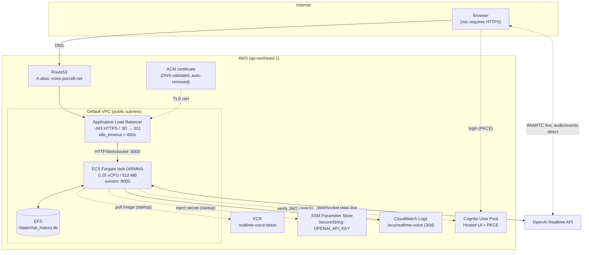
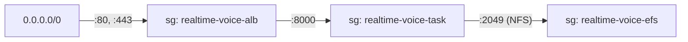

# AWS Architecture

Production architecture for the realtime voice app, managed entirely by Terraform
(`infra/`). One `terraform apply` brings up everything below; one targeted
`terraform destroy` tears it down. Reproducibility is verified: the whole service
layer has been destroyed and rebuilt from scratch with no manual steps.

Live at: **https://voice.pocraft.net**

## Overview

## Components and design decisions

| Component | Choice | Why |
|---|---|---|
| Compute | ECS Fargate, ARM64, 0.25 vCPU / 512 MB | No servers to manage; ARM64 images build natively on Apple Silicon (no cross-build) and cost less |
| Network | Default VPC, public subnets, task gets a public IP | Zero NAT gateway cost; acceptable for a demo service. Task is only reachable through the ALB security group |
| TLS / domain | ACM certificate + Route53 alias | `getUserMedia` (microphone) only works in secure contexts — HTTPS is a hard requirement, not a nicety |
| Load balancer | ALB with `idle_timeout = 400s` | Must exceed uvicorn's WebSocket ping interval (20s default). If the ALB timeout were shorter than the keepalive cadence, long silences in hands-free (VAD) mode would drop the socket |
| History DB | SQLite on EFS, mounted at `/data` | The app is unchanged from local dev — only `DB_PATH` moves. Survives task restarts and redeployments |
| Secrets | SSM SecureString → injected by ECS at task start | See [deployment.md](deployment.md#secrets) |
| Auth | Existing Cognito User Pool (separate Terraform layer) | Service teardown never touches user accounts. The app client's callback URLs include `https://voice.pocraft.net/` |
| Logs | CloudWatch Logs, 30-day retention | `docker logs` equivalent for Fargate |

## Security groups (one-directional chain)

Each hop only accepts traffic from the previous security group, so the task and
the file system are unreachable from the internet.

## The two transport lines in production

- **WebRTC (default)**: audio and events flow browser ⇄ OpenAI directly. The ALB
  only carries the ephemeral-key request, search delegation, and history logging.
- **WebSocket (relay)**: everything traverses ALB → Fargate → OpenAI. This is the
  path the `idle_timeout` rule protects.

## IAM roles

- **Execution role**: pull from ECR, write CloudWatch Logs, read exactly one SSM
  parameter (the OpenAI key). Used by the ECS agent, not the app.
- **Task role**: empty. The app itself calls no AWS APIs at runtime.

## Cost (rough)

ALB ~$20/mo + Fargate (1 task, 0.25 vCPU ARM64) ~$9/mo + EFS/logs/Route53 a few
dollars → **~$30/mo**. To pause compute: set the service's desired count to 0
(the ALB still bills). Full teardown: see
[deployment.md](deployment.md#teardown).
