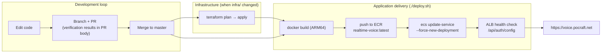

# Deployment

How the realtime voice app gets from a laptop to **https://voice.pocraft.net**.
Infrastructure lives in `infra/` (Terraform); application delivery is
`./deploy.sh`. Architecture details: [aws_architecture.md](aws_architecture.md).

## Delivery pipeline



Today the pipeline is driven from the developer machine (one command per box
group). The natural next step is a GitHub Actions workflow that runs
`docker build` → ECR push → `update-service` on merge to `master`; the AWS-side
shape would not change.

## Prerequisites

- AWS credentials with rights for ECS/ECR/ALB/ACM/Route53/EFS/SSM/IAM/Cognito
- A Route53 public hosted zone for the parent domain (`pocraft.net`)
- Docker (Apple Silicon builds ARM64 natively — matches the Fargate task)
- Terraform >= 1.5, uv (local dev only)

## First-time bring-up

```bash
cd infra
terraform init
echo 'openai_api_key = "sk-..."' > secrets.auto.tfvars   # gitignored
terraform plan     # review; the only change to auth layer is callback URLs
terraform apply    # ~27 resources: ALB, ACM, ECS, EFS, ECR, SSM, IAM, DNS
cd ..
./deploy.sh        # build → push → start the service
```

DNS validation of the ACM certificate and the first task launch each take a few
minutes. When `aws ecs wait services-stable` returns, the URL is live.

## Updating the app

```bash
./deploy.sh
```

That is the whole deployment: build, push `:latest`, force a new deployment,
rolling replacement behind the ALB. Infrastructure changes go through
`terraform plan` / `apply` separately (a clean tree must show `No changes`).

## Secrets

| Secret | At rest | In transit to the app | Notes |
|---|---|---|---|
| `OPENAI_API_KEY` | `backend/.env` (gitignored) locally; `infra/secrets.auto.tfvars` (gitignored) → SSM Parameter Store **SecureString** in AWS | ECS execution role reads the one parameter at task start and injects it as an env var | Never baked into the image (`.dockerignore` excludes `.env`); never sent to the browser — WebRTC clients only get ephemeral `ek_` keys that expire in minutes |
| Cognito IDs (`COGNITO_*`) | Not secrets (public client + PKCE, no client secret exists) | Plain env vars, referenced directly from Terraform's Cognito resources | Single source of truth; no duplication with `.env` |
| Cognito user passwords | Cognito only | — | Admin-created users; the E2E test user (`claude-e2e@…`) is the only account automation may reset |

Known trade-offs, accepted for this project's size: the OpenAI key also appears
in `terraform.tfstate` (local, gitignored) and the task-definition secret
reference is visible (the ARN, not the value) in the AWS console.

## Teardown

Service layer only (auth layer and its user accounts survive):

```bash
cd infra
terraform state list | grep -v cognito | grep -v '^data\.' \
  | while read -r r; do printf ' -target=%q' "$r"; done \
  | xargs terraform destroy -auto-approve
```

Verified 2026-07-17: 26 resources destroyed (state kept only Cognito; ECS
cluster INACTIVE; ALB/ECR/EFS gone; URL unreachable), then a fresh
`terraform apply` + `./deploy.sh` restored the service and the end-to-end voice
test passed again. `terraform destroy` with no targets removes everything
including the user pool — only do that to leave no trace.

## Troubleshooting

- **`docker login` fails with a macOS keychain error** (`already exists in the
  keychain`): bypass the credential store with a throwaway config:
  `export DOCKER_CONFIG=$(mktemp -d) && echo '{"auths":{}}' > $DOCKER_CONFIG/config.json`,
  then log in and push again.
- **Domain does not resolve right after a rebuild**: if anything queried the
  name while the Route53 record was deleted, resolvers cache the NXDOMAIN
  (negative TTL follows the zone's SOA — up to a day). The service is fine;
  verify with `dig voice.pocraft.net @8.8.8.8` and flush the local cache
  (`sudo dscacheutil -flushcache; sudo killall -HUP mDNSResponder`) or wait.
- **Task keeps restarting**: `aws logs tail /ecs/realtime-voice --follow`. The
  usual suspects are a missing image in ECR (push before first deploy) or a
  rejected SSM read (execution-role policy).
- **WebSocket drops during long silences**: check that the ALB `idle_timeout`
  (400s) still exceeds uvicorn's ws ping interval (20s default).
