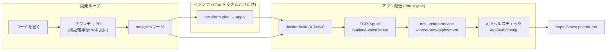

# デプロイ手順

手元のコードが **https://voice.pocraft.net** に届くまでの全経路。インフラは `infra/auth`(認証基盤)と `infra/service`(実行基盤)の2つのTerraformスタック、アプリの配送は `./deploy.sh`。構成の詳細は [aws_architecture.md](aws_architecture.md)。

## デリバリーパイプライン



現状はこのパイプラインを開発マシンから叩いている(各ボックス群がコマンド1つ)。次の自然な一手は、masterへのマージを契機に `docker build` → ECR push → `update-service` を回すGitHub Actions化。AWS側の形は変わらない。

## 前提

- ECS/ECR/ALB/ACM/Route53/EFS/SSM/IAM/Cognito を扱えるAWS認証情報
- 親ドメイン(`pocraft.net`)のRoute53パブリックホストゾーン
- Docker(Apple SiliconはARM64をネイティブビルド——Fargateタスクとアーキテクチャ一致)
- Terraform >= 1.5、uv(ローカル開発のみ)

## Terraformは2スタック(stateを分離)

| スタック | 中身 | destroyしてよいか |
|---|---|---|
| `infra/auth` | Cognito(User Pool=**ユーザーというデータ**を持つ) | **原則しない**。`deletion_protection=ACTIVE`でPool削除は拒否される |
| `infra/service` | ECS/ALB/ACM/EFS/ECR等の実行基盤 | 何度でも壊してよい。authのstateには一切触れない |

serviceはauthの出力(pool id等)を`terraform_remote_state`で参照する。この分離は、ターゲットなしの`terraform destroy`でUser Poolごと消してしまった実際の事故(2026-07-17)への再発防止策。

## 初回構築

```bash
cd infra/auth && terraform init && terraform apply      # 認証基盤(Cognito)
cd ../service && terraform init
echo 'openai_api_key = "sk-..."' > secrets.auto.tfvars   # gitignore済み
terraform apply    # 実行基盤 約27リソース: ALB, ACM, ECS, EFS, ECR, SSM, IAM, DNS
cd ../.. && ./deploy.sh   # build → push → サービス起動
```

auth適用後は `terraform output cognito_env` の値を `backend/.env` に反映し、ユーザーを `admin-create-user` で登録する(セルフサインアップ無効のため)。

ACM証明書のDNS検証と初回タスク起動にそれぞれ数分かかる。`aws ecs wait services-stable` が返ればURLは生きている。

## アプリの更新

```bash
./deploy.sh
```

これがデプロイの全部: build、`:latest` をpush、強制再デプロイ、ALBの後ろでローリング入れ替え。インフラ変更は別途 `terraform plan` / `apply` で(変更がないツリーでは `No changes` になること)。

## シークレット

| 秘密 | 保管場所 | アプリへの経路 | 備考 |
|---|---|---|---|
| `OPENAI_API_KEY` | ローカル: `backend/.env`(gitignore) / AWS: `infra/service/secrets.auto.tfvars`(gitignore) → SSM Parameter Store **SecureString** | タスク起動時にECS実行ロールがその1パラメータだけ読み、環境変数として注入 | イメージには焼かない(`.dockerignore`が`.env`を除外)。ブラウザにも渡らない——WebRTCクライアントが受け取るのは数分で失効する一時キー`ek_`のみ |
| Cognito各種ID(`COGNITO_*`) | 秘密ではない(公開クライアント+PKCE。クライアントシークレット自体が存在しない) | TerraformのCognitoリソースから直接参照して平文envで注入 | 単一の情報源。`.env`との二重管理なし |
| Cognitoユーザーのパスワード | Cognitoのみ | — | ユーザー作成は管理者のみ。自動化がリセットしてよいのはE2E専用ユーザー(`claude-e2e@…`)だけ |

このプロジェクトの規模で許容した割り切り: OpenAIキーは `terraform.tfstate`(ローカル・gitignore)にも写る。またタスク定義にはシークレットの**参照(ARN)**が見える(値は見えない)。

## Teardown(完全削除)

サービス層のみ。stateが分離されているので、素直にdestroyするだけでユーザーアカウントは無傷:

```bash
terraform -chdir=infra/service destroy
```

破壊→再構築の再現性は検証済み(2026-07-17): 全リソース削除→`terraform apply`+`./deploy.sh`で復旧→音声E2E再合格。なおEFSも消えるため会話履歴は失われる。認証基盤まで消したい場合は`infra/auth`側で`deletion_protection`を外してからdestroyする(ユーザー登録が全部消える。実際に一度やらかして作り直した)。

## トラブルシュート

- **`docker login` がmacOSキーチェーンのエラーで失敗する**(`already exists in the keychain`): 使い捨て設定で資格情報ストアを迂回する:
  `export DOCKER_CONFIG=$(mktemp -d) && echo '{"auths":{}}' > $DOCKER_CONFIG/config.json` してから再ログイン・push
- **再構築直後にドメインが引けない**: Route53レコードが消えている間に名前を引いた端末は、NXDOMAINを**ネガティブキャッシュ**する(TTLはゾーンのSOAに従う——最大1日)。サービス自体は無事なので `dig voice.pocraft.net @8.8.8.8` で確認し、ローカルキャッシュを掃除(`sudo dscacheutil -flushcache; sudo killall -HUP mDNSResponder`)するか待つ
- **タスクが再起動を繰り返す**: `aws logs tail /ecs/realtime-voice --follow`。よくある犯人はECRにイメージがない(初回deploy前)か、SSM読み取りの拒否(実行ロールのポリシー)
- **長い無音でWebSocketが切れる**: ALBの`idle_timeout`(400s)がuvicornのws ping間隔(既定20s)より長いままか確認
